<div align="center">


### Two AI models harden your plan before a line of code exists — then swap jobs to build it.

**Fork of [chaseai-yt/claudex-loop](https://github.com/chaseai-yt/claudex-loop)** — adds a
Claude-only reviewer fallback so the loop still runs without the OpenAI Codex CLI.
[What's different →](#whats-different-in-this-fork)

[](https://github.com/nyuhuyang/claudex-loop/stargazers)
[](./LICENSE)
[](https://docs.anthropic.com/en/docs/claude-code)
[](https://github.com/openai/codex)

*The plan that sounds finished usually isn't. In claudex-loop's first real run, a deeply-researched, interview-locked plan still contained **one unbuildable subsystem and six designs that would have corrupted data** — a rival model found all of them before any code existed.*

</div>

---

## Why

AI-assisted coding fails in two places: the gap between **you and Claude** (do we agree on what to build?) and the gap between **Claude and its own output** (is the plan actually correct — and how would you even know?). The model that wrote the plan can't be trusted to grade it. That's an echo chamber.

Claudex-loop closes both gaps: Claude locks intent *with you*, then **OpenAI Codex** — a rival, cross-provider model — attacks the locked plan round after round until it can't find anything else wrong.

```mermaid
flowchart LR
    A["🔍 RECON<br>codebase recon or<br>greenfield research"] --> L["📋 Assumptions Ledger<br>you confirm in one batch"]
    L --> B["🎯 INTERROGATE<br>load-bearing questions<br>one at a time"]
    B --> P["PLAN.md locked"]
    P --> C["⚔️ REVIEW<br>Codex attacks in a<br>read-only sandbox"]
    C -- REVISE --> R["Claude arbitrates<br>and revises"]
    R -- same session --> C
    C -- APPROVED --> S["✍️ You sign off"]
    S -. optional .-> D["🔨 BUILD<br>one model writes"]
    D --> I["🔬 CROSS-INSPECT<br>the other model<br>grades the diff"]
    I --> G["✅ You approve<br>the final diff"]
    classDef claude fill:#d97757,stroke:#7a3a24,color:#fff
    classDef codex fill:#10a37f,stroke:#0a6b54,color:#fff
    classDef human fill:#e8b93e,stroke:#8a6a14,color:#1a1a1a
    classDef artifact fill:#3d3d3d,stroke:#6b6b6b,color:#fff
    class A,B,R claude
    class C,D codex
    class I artifact
    class L,S,G human
    class P artifact
```



**You enter at four points only:** confirming the ledger, answering the interview, signing off the converged plan, and approving the final diff if you build. Codex is read-only throughout review and never touches a file.

## The four phases

| | What happens | What makes it different |
|---|---|---|
| **🔍 0 — RECON** | Claude scouts *before* asking you anything — explores the codebase and living docs, or on greenfield researches prior art, stacks, and known pitfalls (research depth is a gate **you** control, up to a multi-agent deep-research workflow) | Opens with an **Assumptions Ledger**: everything already resolved, batch-confirmed in one reply. The interview never wastes questions the code or research already answered |
| **🎯 1 — INTERROGATE** | A visible **decision map** splits open decisions into load-bearing (asked one at a time) and cosmetic (batched, veto-by-exception) | Every question must justify its existence: *why it matters*, a committed *recommendation*, and *what breaks if we guess wrong*. Escape hatch: "accept all remaining recommendations" |
| **⚔️ 2 — REVIEW** | Codex reviews `PLAN.md` in a read-only sandbox → `VERDICT: APPROVED` or `REVISE` with concrete flaws. Claude arbitrates (rejects bad critiques *with logged reasons*), revises, and resumes the **same Codex session** | The reviewer remembers its prior findings and attacks its own accepted fixes. Bounded by `MAX_ROUNDS` — a flagged deadlock beats a fake "approved" |
| **🔨 3 — BUILD** *(optional)* | You pick the builder. **Codex builds** (`codex-build`, full write access) → Claude reads the entire diff like a contributor PR and runs the proof test itself. **Claude builds** → a *fresh* read-only Codex session cross-inspects the finished diff against the plan — on by default, findings arbitrated and logged | The final code is always graded by the rival model, whichever one wrote it. Skipping the inspection requires an explicit, logged opt-out |

**The invariant across all four:** *whoever made the thing never checks the thing.* Plan by Claude → attacked by Codex. Code by Codex → reviewed by Claude. Code by Claude → inspected by Codex. No one grades their own work, in any path.

Two artifacts every run: `PLAN.md` (the *what*) and `PLAN-REVIEW-LOG.md` (the full round-by-round argument — the *why*).

## Receipts

From the first end-to-end greenfield run (a solo-creator CRM):

<p align="center"></p>

- **55 findings across 5 rounds** — converging 26 → 15 → 12 → 2 → 0
- **1 fatal:** an access-path architecture that could not be built as written (read as completely plausible)
- **~6 wrong models** that would have shipped and corrupted data weeks later
- **~7 missing subsystems**, including the homepage feature that had no backing data source
- **What survived untouched:** every product decision from the interview. The review only ever attacked *how it would break* — the phases genuinely divide the labor

## Install

### Option A — Plugin *(recommended: updates flow automatically)*

```
/plugin marketplace add nyuhuyang/claudex-loop
/plugin install claudex-loop@claudex-loop
```

Skills arrive namespaced: `/claudex-loop:claudex-loop`, `/claudex-loop:codex-review`, `/claudex-loop:codex-build`. (Intent triggering works regardless — say "claudex this plan" or even the legacy "crucible this plan" and the right skill fires.) Enable auto-update for the marketplace in the `/plugin` menu and new versions pull in on their own.

Or from a shell, without starting a session:

```bash
claude plugin marketplace add nyuhuyang/claudex-loop
claude plugin install claudex-loop@claudex-loop
```

> **Already have upstream installed?** Both marketplaces declare the name `claudex-loop`, so they
> collide. Remove the old one first: `claude plugin marketplace remove claudex-loop`, then add this
> one. To go back, re-add `chaseai-yt/claudex-loop` the same way.

> **There is no `npx` install.** This repo ships markdown skills and `.claude-plugin/` manifests —
> no `package.json`, no `bin`. `npx nyuhuyang/claudex-loop` has nothing to execute. Use the plugin
> commands above, or Option B.

### Option B — Manual copy *(bare skill names)*

```bash
git clone https://github.com/nyuhuyang/claudex-loop && cd claudex-loop

# macOS / Linux
cp -r skills/* ~/.claude/skills/

# Windows (PowerShell)
Copy-Item -Recurse skills\* $env:USERPROFILE\.claude\skills\
```

Invoke as `/claudex-loop`, `/codex-review`, `/codex-build`. Update by `git pull` + re-copy.

> **Coming from grill-me-codex or crucible?** This repo *was* both — GitHub redirects the old URLs, so `git pull` in your existing clone just works. The old grill skills live on in [`legacy/`](./legacy/) (copy them only if you want them; `/claudex-loop` doesn't need them).

## Prerequisites

- **Codex CLI ≥ 0.130** *(recommended — this is the default reviewer)* — `npm install -g @openai/codex@latest`
- **Authenticated** — `codex login` once (any ChatGPT account: Free/Plus/Pro/Max)
- **Don't pin a model** — ChatGPT-account auth rejects `gpt-5.x-codex` variants; the skills use your config default and echo the active model at kickoff so you can veto before a round burns

No Codex? The loop still runs — see below.

### No Codex?

`claudex-loop` and `codex-review` probe both providers before they ask you anything. If the Codex
CLI is missing, older than 0.130, or logged out, Phase 2 falls back to a **separate isolated Claude
session** as the reviewer, and tells you so up front:

> Codex unavailable (<sanitized reason>). Falling back to Claude-only review: a separate
> `claude -p` session, restricted to Read/Grep/Glob, reviews your plan.
> **Kept:** a reviewer with no inherited primary-session context — no CLAUDE.md, no user/project
> custom hooks, no output styles, plugins, or MCP (managed enterprise settings may still apply) —
> plus its own cross-round memory of this review, the VERDICT gate, MAX_ROUNDS, and Claude as
> final arbiter.
> **Lost:** cross-provider blind-spot decorrelation. Same-family models have correlated systematic
> blind spots — they favour the same architectures and miss the same edge cases. The read-only
> guarantee is also weaker: tool-level restriction, not Codex's OS-level filesystem sandbox.
> This is a downgrade path, not a peer option. Full effect:
> `npm i -g @openai/codex && codex login`.

Force either reviewer with `reviewer=codex` or `reviewer=claude`. An override is a preference, not
a capability claim — forcing a reviewer that can't run stops with the probe error rather than
silently degrading. Choosing `reviewer=claude` does *not* disable `/codex-build`; reviewer and
builder are independent.

## Tunables

| Skill | Var | Default | Meaning |
|-------|-----|---------|---------|
| `claudex-loop` | `research` | ask | `none` / `web` / `deep` — pre-answers the Phase 0 research gate |
| review skills | `reviewer` | auto-detect | `codex` / `claude` — force a reviewer instead of probing |
| review skills | `REVIEWER_MODEL` | `opus` | Reviewer model on the Claude fallback path |
| review skills | `REVIEWER_EFFORT` | `high` | Reviewer reasons longer than the planner did |
| review skills | `MAX_ROUNDS` | `5` | Hard cap on review rounds |
| review skills | `PLAN_FILE` | `PLAN.md` | Where the plan lives |
| all | `LOG_FILE` | `PLAN-REVIEW-LOG.md` | The argument transcript |
| `codex-build` | `SPEC_FILE` | `PLAN.md` | The frozen spec Codex implements |
| `codex-build` | `MAX_FIX_ROUNDS` | `2` | Fix rounds before Claude takes over |
| `codex-build` | `PROOF_CMD` | from spec | Exact test command that counts as proof |

Pass e.g. `rounds=3` when invoking to override.

## Safety

**Review (Phases 0–2):** Codex runs **read-only every round** — `-s read-only` on the first call, `-c sandbox_mode="read-only"` on every resume (the `resume` subcommand doesn't accept `-s`, and without forcing read-only it would inherit your `config.toml` sandbox default, which may be `danger-full-access`). The skills handle this for you. No code is written until you approve the final plan.

**Review on the Claude fallback path** is read-only too, but by a *weaker* mechanism, and the skills say so rather than claiming parity. The reviewer runs `--restricted --tools "Read,Grep,Glob" --strict-mcp-config --safe-mode --permission-mode dontAsk`, which exposes exactly three tools. An allow/deny list alone is **not** enough: `--allowedTools`/`--disallowedTools` leaves `Agent`, `Workflow`, `ToolSearch` and `WebFetch` live, and `Agent` defeats a denylist outright because a spawned subagent carries its own Write and Bash. Even with the right flags this is tool-level restriction enforced by the Claude Code process — not an OS-enforced read-only mount — and managed enterprise settings still apply.

**`codex-build` (Phase 3)** deliberately inverts this: Codex gets full write access — which is exactly why the skill gates it hard. Clean git tree before launch, Claude reads every line of the diff and runs the proof itself, fix rounds bounded, commits human-gated and Claude-authored. Resume calls need the long flag `--dangerously-bypass-approvals-and-sandbox` (resume has no `--yolo`) — and always resume by explicit `thread_id`, never `--last`.

## What's different in this fork

Upstream requires the OpenAI Codex CLI. If you don't have it — no ChatGPT account, corporate
policy, or just not installed — Phase 2 could not run at all. This fork adds an announced fallback
to a second, isolated Claude session as the adversarial reviewer.

**The reviewer is still Codex by default.** Nothing changes when Codex is present.

| | Upstream | This fork |
|---|---|---|
| Codex present | Phase 2 runs | identical, unchanged |
| Codex missing / < 0.130 / logged out | dead end | falls back to an isolated read-only Claude reviewer, and says what that costs |
| Reviewer choice | implicit | `reviewer=codex\|claude` — a preference, never a capability claim |

### What the fallback keeps, and what it loses

**Keeps:** a reviewer with no inherited primary-session context — no `CLAUDE.md`, no user/project
hooks, no output styles, plugins, or MCP — plus its own cross-round memory, the VERDICT gate,
`MAX_ROUNDS`, and Claude as final arbiter.

**Loses:** cross-provider blind-spot decorrelation. Same-family models have correlated systematic
blind spots. The read-only guarantee is also weaker — tool-level restriction, not Codex's OS-level
filesystem sandbox, and managed enterprise settings still apply.

**This is a downgrade path, not a peer option**, and the skill says so at runtime rather than
letting you assume parity.

### Other fixes this work surfaced

Hardening the fallback exposed bugs on the shared paths too:

- **`git diff BASE..HEAD` in Phase 3 was always empty.** Before the human commit gate `HEAD` still
  equals the base commit, so the cross-inspection reviewed nothing while reporting success. Now
  `git diff BASE --` behind a clean-tree gate, with the base held outside the repo.
- **Reviewer launches were piped into `grep`,** so `$?` was `grep`'s status — a reviewer that died
  after emitting `thread.started` read as success. Status, stdout, and stderr are now captured
  separately.
- **Verdict validation counted the bare substring `VERDICT:`,** which flags a valid review that
  quotes the instruction back. Now an anchored line match.
- **Quota exhaustion** was an unhandled failure class, and its reason arrives on stdout or the
  events stream, not stderr.
- `--no-renames` on evidence commands, `mktemp -d` instead of fixed `/tmp` paths (symlink + race),
  exhaustive failure-transition tables, and `PLAN_FILE` actually propagated to the build handoff.

### New tunables

| Var | Default | Meaning |
|---|---|---|
| `reviewer` | auto-detect | `codex` / `claude` |
| `REVIEWER_MODEL` | `opus` | Reviewer model on the Claude path |
| `REVIEWER_EFFORT` | `high` | Reviewer reasons longer than the planner did |

### How it was built

Through the skill itself. [`PLAN.md`](./PLAN.md) is the locked spec; [`PLAN-REVIEW-LOG.md`](./PLAN-REVIEW-LOG.md)
is the full argument — five rounds of adversarial Codex review (15 → 9 → 6 → 6 → 0 findings), then a
Claude build, then two rounds of cross-inspection that found 13 more. Read the log if you want to
see what the loop actually catches.

## Credits

- Forked from [chaseai-yt/claudex-loop](https://github.com/chaseai-yt/claudex-loop) — the four-phase
  loop, the interview redesign, and all original packaging are theirs. This fork adds the
  Claude-only reviewer path.
- The [`legacy/`](./legacy/) skills' Act 1 (`grill-me`, `grill-with-docs`) © [Matt Pocock](https://github.com/mattpocock/skills) (MIT) — see their `THIRD-PARTY-NOTICES.md`. Claudex-loop's interview is an original redesign.
- Phase 3's Codex-as-builder pattern adapted from Peter Steinberger's [`codex-first`](https://github.com/steipete/agent-scripts).
- Claudex-loop, the iterative cross-model review, and packaging by [Chase AI](https://youtube.com/@chaseai).

<div align="center">

**Want to go deeper?** The **Claude Code Masterclass** and a community of builders shipping with agentic AI live inside [**Chase AI+**](https://www.skool.com/chase-ai/about)

*MIT — see [LICENSE](./LICENSE)*

</div>
